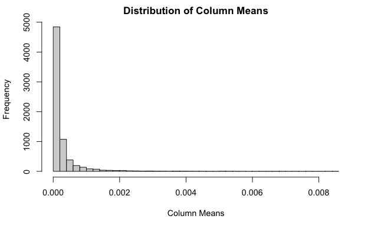
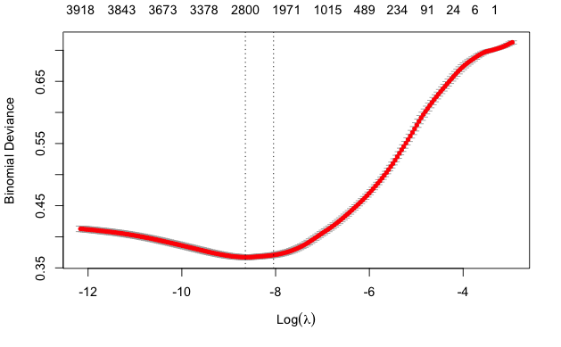
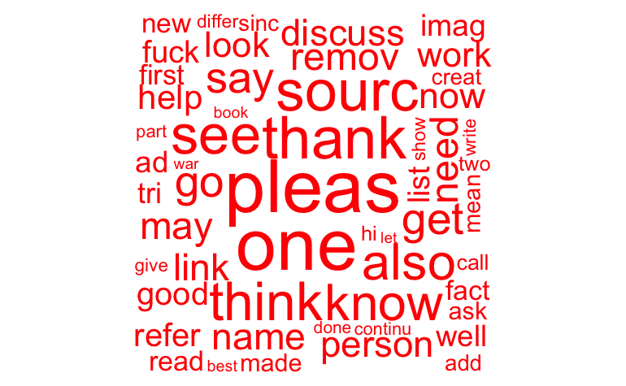
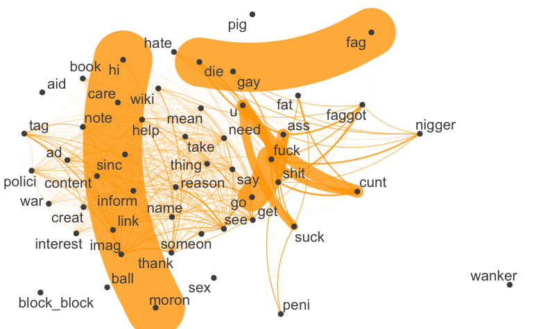
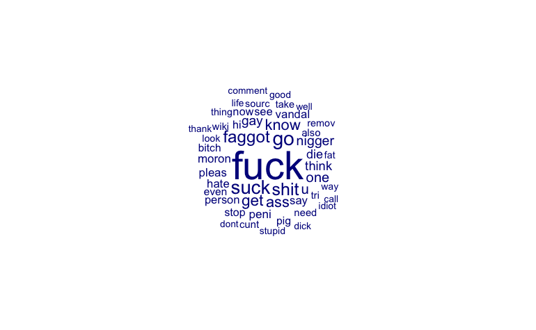
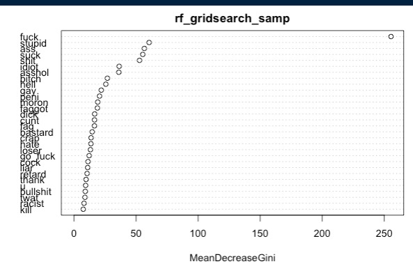

```{r setup, include=FALSE}
knitr::opts_chunk$set(echo = TRUE)

set.seed(1)
```

## 1. Introduction

Our overarching intention is to strike a balance between prediction and interpretability, as we believe that machine learning (ML) models optimised for impact are required to be able to _explain_ our model's predictions to stakeholders as well as predicting well in order to inform stakeholder decision making in the context of online attacks. This is aligned with Christoph Molnar's work on using ML interpretability to bolster the impact of opaque ML strategies (Molnar, 2022).

To begin, we performed exploratory data analysis. This analysis was used to inform our selection of features, loss function, algorithms to test (model choice), and also acted as a heuristic guide to help us iteratively evaluate our expectations around complexity needs and any other design considerations that might be necessary. We performed this analysis across 3 facets: frequency, sparseness, and similarity of our sample. We will now briefly detail our findings and link them to practical implications. The first thing to note is that the training set is imbalanced, with 113067 (88.5%) negative class observations and 14681 (11.5%) in the positive class. It is worth noting here that the 'positive' class is toxic.

## 2. Feature Selection

Our feature selection comprises any and all decisions to reduce the number of features that are deemed not important for our classification task at hand. We conduct a three-stage procedure for feature selection.

*First-stage*

We were guided in our initial expectations around feature selection by Wulczyn, Thain & Dixon (2017), who use 3-5 character n-grams when optimising for prediction, which aligns with the findings of Nobata et al. (2016) that suggests character n-grams are more robust to the lexical diversity common to personal attacks online as they are more capable of making allowances for spelling variations. However, the computational cost of character n-grams (due to the large number of features) stalled all of our modelling endeavours without dedicated scaleable computing resources. Another key drawback of using character n-grams is the loss of substantive interpretability as character combinations have less 'meaning' linguistically than words or combinations of words. This is illustrated in our analysis of top features for both word and character n-grams. Our top features using character n-grams were often uninterpretable (such as in the case of 'w_w_w', or 'n_n_n'), whereas our top features for word n-grams made substantive sense in the context of our task, classifying toxic comments (such as in the case of expletives, racial slurs and words such as 'moron' and 'die').

As with the majority of quantitative text analysis analyses, the removal of punctuation and stopwords is a crucial step in feature selection. Punctuation marks and stopwords, such as "the," "a," and "and," do not carry significant meaning in textual analysis and can skew the results of statistical analysis. By removing these elements, we can reduce noise in our data, reduce computational cost, and focus on the meaningful words and phrases. We also lower cased all the words to ensure that no words were accidentally excluded from our preprocessing.

We intended to optimise the word frequency cutoff during tokenisation but found that, again, we were heavily constrained by computational cost. We thus had to choose a value, 75, that enabled us to reduce our dimensionality so that we could complete our modelling rather than optimising this hyperparameter for prediction. However, we did use EDA to explore whether any potential transformations might act as powerful predictors of toxicity in comments. 

Furthermore in exploratory data analysis we looked at the top features of comments classified as toxic vs. not toxic to see which words were in the top features of both. We created a vector of those words called “manual vector” and removed them.

*Second-stage*

Term frequency-inverse document frequency (henceforth TF-IDF) is a statistical measure that is used to evaluate the importance of a word in a document based on its frequency across the document and its occurrence across all documents in the corpus. This technique is widely used in simplifying quantitative text analysis models because it helps to reduce the noise in the data by giving low weights to terms that are frequent in many documents and frequent throughout the text. TF-IDF assigns higher weights to words that are more unique to certain documents, indicating that these words are more representative of the document's content. By using TF-IDF for feature selection we are able to remove words that are common throughout all documents, and therefore adding noise into our dataset.

Once we compute the TFIDF values for feature in our DFM, we look at the column means of the TFIDF values (since each column is an ngram, the columns means tells us the average weight that feature is assigned throughout documents). We then generated the histogram in Figure 1 of the Appendix. You can see the data is heavily left skewed, this make sense because a lot of words are uninformative and common across texts due to them all being in English. We remove words with a column mean a less than .0001, a number which we got from looking at the histogram and trying to find a bucket that would be impactful without over trimming the features. We then remove those words from our DFM in order to reduce dimensionality to help our models identify words that are important to toxicity faster.

*Third-stage*

Our final stage of feature selection was performed using LASSO. LASSO combines logistic regression with a dimensionality reduction function which reduces the coefficient of non-important features to 0. This enables us to identify obsolete features (where coefficient equals 0), and remove them.  First, we used cross-validation to optimise our lambda hyperparameter (penalisation value). Our optimum value for lambda is 0.000176. We plotted lambda against binomial deviance, and this optimum value of lambda can be seen in Figure 2 of the appendix.

We limited the number of folds to 5 and the number of iterations to 10,000 per fold (from the default of 100,000) due to computational cost. However, in order to balance the risk of a loss in generalisation error, we increased the number of lambdas tested from the standard 101 to 200. This increased our confidence that our optimum lambda value would not be missed.

In order to be lenient, and not remove too many features, we chose to select the LASSO model that uses a lambda value that is 1 standard error away from our optimum lambda value. As lambda increases past this optimum range and more coefficients converge to 0, the error begins to increase at an accelerating rate. Using said model, we identified all of the features whose coefficient had been reduced to 0, and removed them from our training set. We identified 1691 features via this method and removed them, leaving us with 2291 features after selecting features via LASSO to train our other models. 

_2.1 Wordcloud & Top Features_

After feature selection, we created a word cloud to have a clear visualization of the most common features in our data frame (the whole training set and the training set filtered for toxic values only). As you can see in figures 3, 4, and 5, there is a very clear difference between the two. The latter being filled with slurs, expletives, and other derogatory words. We have also constructed a network graph to show how different words are related to one another. Words connected by nodes are often found together in the same toxic comments. This visualization is helpful to show that our feature selection has clearly delineated between toxic and non-toxic comments. 

Additionally, we hypothesized that the length of comments might typically differ between toxic and non-toxic comments, and tested this with a t.test on the difference in mean lengths of comments for those already classified in our training set. We found the difference in length to be statistically significant at the 0.0001 level, with toxic comments being shorter by an average of around 95 characters. However, due to time constraints we were not able to do anything with this finding.

## 3. Modelling Choices

_3.1. Choice of Loss Function_
  
We considered both distance-based and purity-based loss functions for our model and used EDA to advise this selection process. 

Our analysis of sparseness was the main analytical driver behind our choice of loss function. We performed a number of sparsity checks after our pre-processing, and found that our sample is extremely sparse, with the training set having a sparsity metric of _99.3_ (around _0.7%_ contains non-zero values in our dfm). We have approximately _2291_ n-grams (p) over _127,748_ comments (n), indicating a high degree of dimensionality and sparseness that aligns with our prior metrics. This has strong implications for our choice of loss function - as sparseness of data implies that distance-based metrics for loss functions will perform poorly due to the large distance and lack of similarity between observations. Thus, we believe that purity-based metrics will perform better as our loss function. To validate this finding, We performed a lexical diversity analysis and found that the mean Type-Token Ratio was _0.90_ for our training data (with 1 being lexical purity). This re-affirms the notion of sparseness. Thus, where possible, we have chosen to deploy purity-based loss functions over distance-based ones. This choice, however, is limited by our selection of algorithms based on computational cost.

We considered two purity-based loss functions for binary classification tasks, 'Binary Cross Entropy Loss' and 'Hinge Loss.' Hinge Loss has the added characteristic that it penalises less confident correct predictions. However, Hinge Loss is primarily used for SVM algorithms and is known to be difficult to derive probability estimations from this function. We want to select a loss function that can be used to optimise each of our models, and one that provides a probability estimate, akin to the choice made by Wulczyn, Thain & Dixon when evaluating certainty in coder and model classification. Binary Cross Entropy Loss satisfies this criterium whilst also providing us with a substantively interpretable probability of classification into the positive class. 

_3.2. Choice of Algorithm_
  
Our exploratory data analysis acts as a guide for expectations of which models are likely to predict best in this binary text classification task. We tried to cover different categories of models, including LASSO, those that use Bayes Theorem, Tree-based models, and Support Vector Machines (SVM). Feature selection and dimensionality reduction are key priorities for us due to computing constraints and our desire to substantively interpret our model. Thus, we chose to use LASSO to both predict toxic comments and to inform our feature selection via dimensionality reduciton. Following this, we felt that the required criterium above and the need for capturing conditionality due to co-occurrence of words as predictors meant that it would be worthwhile testing a Naive Bayes Classifier. Next, we tested an SVM because the sparsity of data meant that we expected to find a linearly seperable decision boundary. Finally, we tested a random forest model, as this model is known to deal with co-linearity and ability to classify in high-dimensional space whilst still generating variable importance measures, which contribute to the balancing of interpretability and prediction.

In addition to LASSO, which was predominantly deployed for feature selection, we optimised and trained the following models. All values for CV and Test Error can be found in the table in 'Final Model.' 

_3.3 Naive Bayes Classifier_

Naive Bayes is a form of supervised machine learning that calculates the word likelihood within each class in order to classify a document. It classifies documents in the test set by comparing the word probabilities of all the words in the document to its learnings from the training set. It is important to note that Naive Bayes uses a bag of words model and incorrectly assumes: conditional and positional independence of words. Because of this the model is flawed, but it is popularly used in data science to predict document classification and past literature has found it to be quite effective. The model does not take any parameters, so we simply run a k-folds (n = 10) cross validation on the model with our trained dfm weighted by the TF-IDF. As you can see in Table 3, it had an F1 score of .63.

_3.4 Support Vector Machines_

Support Vector Machines (SVM)  construct a separating hyperplane to distinguish between two classes. We anticipate SVM to perform well with the data. As noted in our EDA section, the data are very sparse as it is highly dimensional. In high-dimensional data, the number of features can be much larger than the number of observations, which can make it challenging to find a good separation boundary. SVMs address this by transforming the high-dimensional feature space into a lower-dimensional space (sometimes using kernels too), where it is easier to find a good separating hyperplane. Furthermore, if using a kernel function, SVMs are able to capture non-linear relationships between the input variables without explicitly computing them. The kernel function implicitly maps the input data into the higher-dimensional feature space, where the SVM algorithm can find a linear boundary that separates the classes.

The main model hyperparameters that should be tuned are `cost` (refers to the penalty that is applied to the SVM optimization objective function when a data point is misclassified) and `kernel` (function that is used to transform the input data into a higher-dimensional feature space). Unfortunately, in the textmodel_svm arguments there is no option to optimise the `kernel` value. To adjust for more model flexibility, and with the lack of `kernel` modification, we adopt `epsilon` (determines the width of the margin, or the maximum distance between the regression function and the actual target values) as another model hyperparameter. 

Selection a value of `epsilon` that is too small will likely result in overfitting of model to the data so that we will get low bias but high variance. Similarly, if `cost` is too high then this will also result in overfitting of the model. To cater for the variation in the effect of these hyperparameters, we construct an evaluation process which conducts cross validation and a grid search for a range of values of these hyperparameters. We select three values for `epsilon`, 0.01, 0.05 and 0.1, on the basis that if `type` were to be adjusted the value of `epsilon` would automatically vary between 0.01 and 0.1. `cost` is 1 by default, so we select 2, 5 and 10 to be tested. The value of `k` is set to 3; thus, for each combination of the hyperparameters, three splits will be made and assessed; $3\times3\times3=27$. Table 1 and 2 in the appendix show the mean statistics for each distinct value of `cost` and `epsilon`, respectively.

We can see that the best `cost` value if optimising for F1 score is `cost` = 5. The optimal `epsilon` value is 0.05.

_3.5 Random Forest_

Random Forests randomly sample variables by which to split each tree. In a random forest, there are two key model hyperparameters that need to be optimised - `ntree` (the number of trees to grow and aggregate over), and `mtry` (the optimum number of random variables to include at each split). This randomisation partially circumvents the need for cross validation, as the random forest algorithm automatically optimises for `mtry` and variance is reduced through randomisation. It is common practice to set `ntree` to 500, as there is a great deal of evidence to suggest that improvements in error flatten at that value. However, this comes with a great computational cost and, due to limited resources, we are forced to limit our number of trees to 50. When `ntree` = 50 and the algorithm optimises for `mtry` = 69, we know that 3,450 features are randomly selected in total to inform our predictive decision-making. This means that we do not use all of our features at least one to train our model, and thus expect a low performing prediction due to the risk of excluding important features during training. As a result of this computing cost, we chose to initially train our model on a subset of our training data. The length of time required to do this led us to believe that it wouldn't be possible to operationalise a final RF model to predict out-of-sample. Given additional computing resources, we could optimise the number of trees based on relative accuracy improvements at each value of `ntree`.

Despite this limitation, Random Forests uses the Gini Index to provide variable importance measurements. We chose to continue to develop an RF after identifying the above constraints due to this, as we intend for our feature selection and model choices to be embedded within one another. The variable importance plot shown in Figure 3 of the appendix details the variables that our RF algorithm deemed to be most important when making predictions on toxicity in our subset.

As expected, slurs, expletives, internet slang and violent imperatives were extremely important in determining our prediction outcomes. The word 'fuck' was an extremely powerful predictor, with double the mean decrease in Gini score compared to the second most powerful predictor. Unfortunately, we were not able to take this algorithm and train it on our entire training set due to computational constraints. As a result, we were unable to retrieve a 'final' model with which to predict out-of-sample, so our Random Forest model's primary utility is the provision of information on variable importance. This is a lesson learnt, and next time we will try to access a scaleable resource in order to deploy this powerful algorithm. 


## 4. Final Model

This section provides and overview of the performance of each model based on a variety of evaluatory metrics, including our chosen loss function. We present our final chosen model in the context of these metrics. The 'CV Error' is our own assessment of the model using a validation set from the train data that was initially provided to us in the `coms_tr.csv` file. 'Test Error' is a direct representation of how this model performed on the Kaggle submission space. The 'Hyperparameters' and 'Comments' field provide further detail on the set-up of these models.

As we can see from Table 3 in the appendix, all models performed at a better-than-chance rate for both the CV error and Test error, besides from the random forest model which, due to computing resource, was not able to be computed. Our first model, the naive bayes classifier, receives a CV error of 0.652 and test error of 0.638. Our second model, a support vector machine algorithm trained on the default values for both `cost` and `epsilon` receives a CV error of 0.663 and a test error of 0.707. The third (but incomplete) model, is our random forest algorithm. With promising results from CV error when adjust for `ntree` = 50 and `mtry` = 69. Our fourth model, the LASSO algorithm, achieves a 0.633 for CV error and 0.650 for test error. The value of `lambda` is tuned for feature selection purposes, at a level of 0.000176, not test error performance. Last but not least, our fifth model, which is our optimised support vector machine, is also our final chosen model. With the highest CV error observed, at 0.742, and a subsequent test error of 0.714. Using CV and grid search, we are able to tune the two chosen model hyperparameters for this model to achieve these high scores.

## 5. Limitations & Further Scope

There are two main limitations to our approach of this project. The first limitation is within our tokenisation process. Our tokenisation process, which is discussed and justified in the first stage of section 2 (Feature Selection), removes all punctuation and procedes to make all words lowercase. While these are common adjustments in quantitative text analysis, in the specific study of hate speech these specific tokenisations can limit predictive capacity. The use of capital letters and excessive punctuation marks tend to be used online to communicate emotion (Salminen et al., 2020); by removing these elements of the text, we may also be losing valuable features for our models to use in their prediction of toxicity. With more time, we would like to recreate our analysis but with these aspects of text in tact.

The second limitation is due to restrictions in computing resources and the compromises that were made to cater for this. Not only were we severely limited by our access to scaling computing resources, but also members of the group were disparately affected by this issue. As a result, we were bounded two-fold: first, in needing to make decisions regarding various parameters and functions so that computing time is reduced, such as hyperparameters (e.g. K in K-fold cross validation, or `mindocfreq`). Second, reduced (sometimes no) access to some model architectures that we were hoping to use. If we were able to overcome our computing resouce limitations, we would have liked to further experiment with complex ML models that deal with high dimensionality and non-linearity, such as Random Forests and Neural Networks. However, due to sparseness leading to viable linearly seperable decision boundaries, it is difficult to say whether we expect these models to outperform our current selection.

## 6. Conclusion

To summarise, we were able to identify many of the key characteristics of the data fairly early on by utilising visual and statistic exploratory data analysis, which informed all facets of our modelling process. We chose to strike a balance between interpretability and predictive power in the pursuit of a model that is likely to affect and justify decision making for stakeholders. This affected our choice of models and loss functions. We chose to test a number of popular models that have been evidenced to predict well with sparse text data in high dimensionality and found that SVM was superior once we were able to optimise the necessary hyperparameters. We then chose SVM as our final model because of its high relative F1-score. 

## 7. Citations

Wulczyn, E., Thain, N., & Dixon, L. (2017, April). Ex machina: Personal attacks seen at scale. In Proceedings of the 26th international conference on world wide web (pp. 1391-1399).

Nobata, C., Tetreault, J., Thomas, A., Mehdad, Y., & Chang, Y. (2016, April). Abusive language detection in online user content. In Proceedings of the 25th international conference on world wide web (pp. 145-153).

Holzinger, A., Saranti, A., Molnar, C., Biecek, P., & Samek, W. (2022, April). Explainable AI methods-a brief overview. In xxAI-Beyond Explainable AI: International Workshop, Held in Conjunction with ICML 2020, July 18, 2020, Vienna, Austria, Revised and Extended Papers (pp. 13-38). Cham: Springer International Publishing.

Salminen, J., Hopf, M., Chowdhury, S. A., Jung, S. G., Almerekhi, H., & Jansen, B. J. (2020). Developing an online hate classifier for multiple social media platforms. Human-centric Computing and Information Sciences, 10, 1-34.

\newpage

## 8. Appendix 

\begin{table}[ht]
\centering
\begin{tabular}{ccccccc}
\hline
cost & k & f1\_score & epsilon & time & seed \\
\hline
2 & 2 & 0.8446375 & 0.05333333 & 11.02667 & 1 \\
5 & 2 & 0.8457353 & 0.05333333 & 20.53667 & 1 \\
10 & 2 & 0.8466549 & 0.05333333 & 32.51778 & 1 \\
\hline
\end{tabular}
\caption{Summary of Evaluation Grouped by Cost Value}
\label{tab:example}
\end{table}


\begin{table}[ht]
\centering
\begin{tabular}{ccccccc}
\hline
epsilon & k & f1\_score & cost & time & seed \\
\hline
0.01 & 2 & 0.8456394 & 5.666667 & 24.57667 & 1\\
0.05 & 2 & 0.8456920 & 5.666667 & 20.58444 & 1\\
0.10 & 2 & 0.8456963 & 5.666667 & 18.92000 & 1\\
\hline
\end{tabular}
\caption{Summary of Evaluation Grouped by Epsilon Value}
\label{tab:example}
\end{table}


\begin{table}[ht]
\centering
\begin{tabular}{ccccc}
\hline
Algorithm & CV\_Error & Test\_F1 & Hyperparameters \\
\hline
Naive Bayes Classifier & 0.652 & 0.638 & N/A \\
Support Vector Machine & 0.663 & 0.707 & cost = 1, epsilon = 0.01 \\
Random Forest & 0.657 & N/A & ntree = 50, mtry = 69 \\
LASSO & 0.633 & 0.650 & lambda = 0.000176 \\
Support Vector Machine & 0.742 & 0.714 & cost = 10, epsilon = 0.1 \\
\hline
\end{tabular}
\caption{Assessment of Models}
\label{tab:example}
\end{table}


 
















